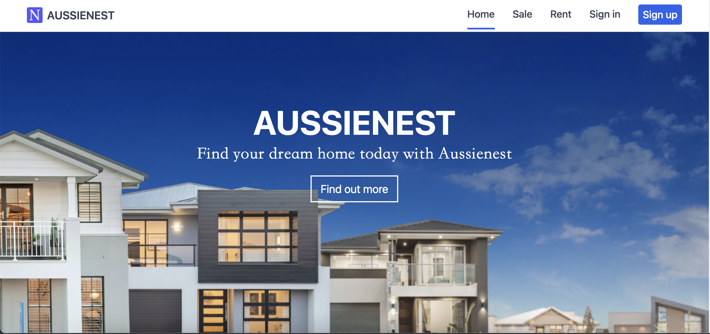
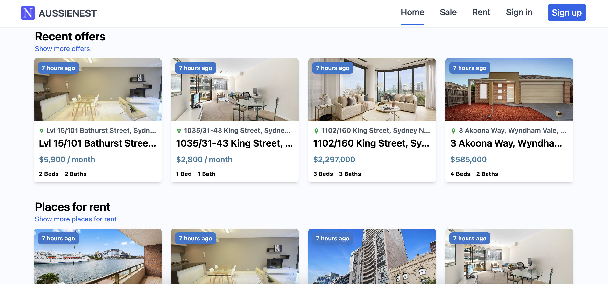
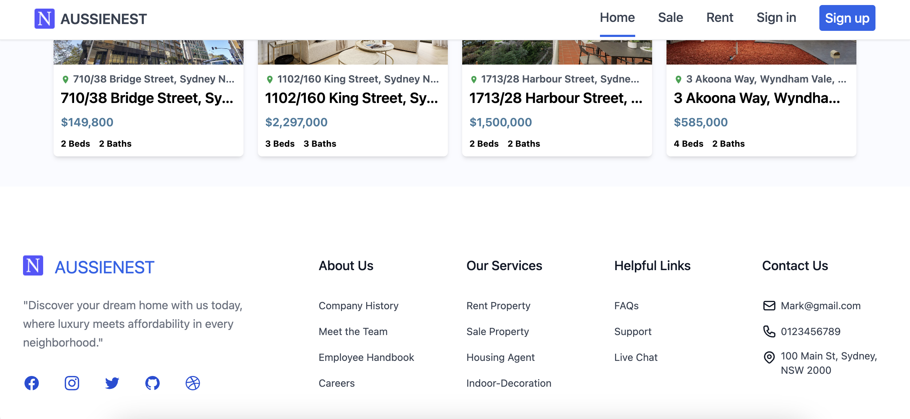
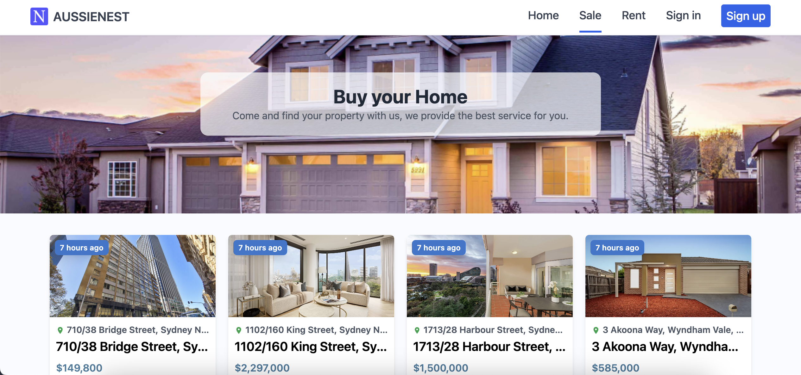
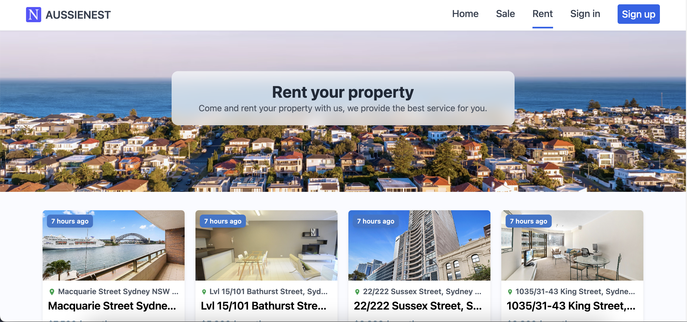
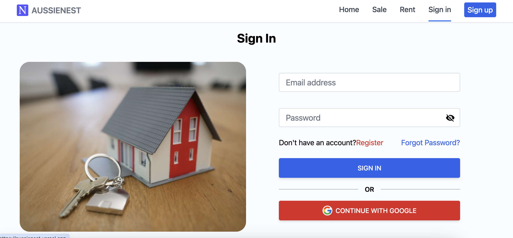
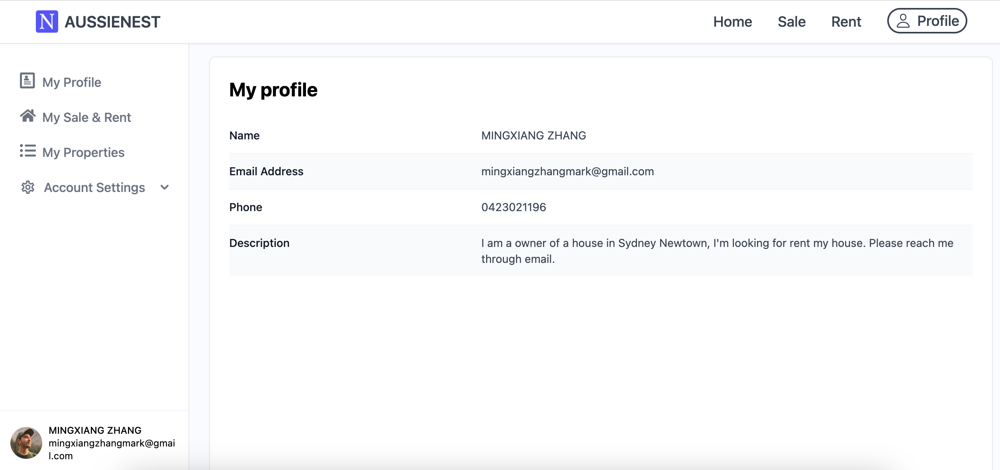
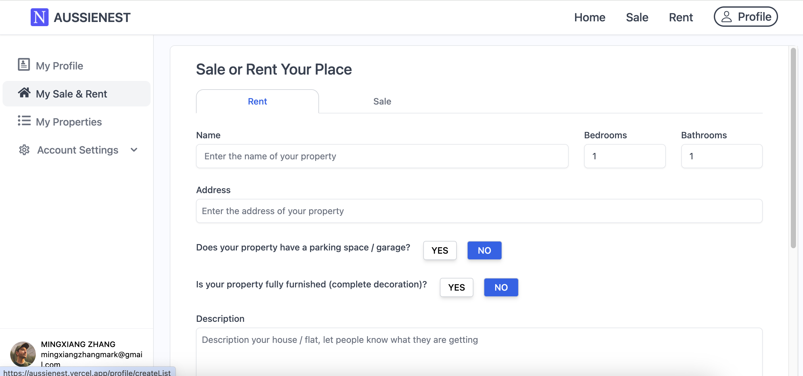
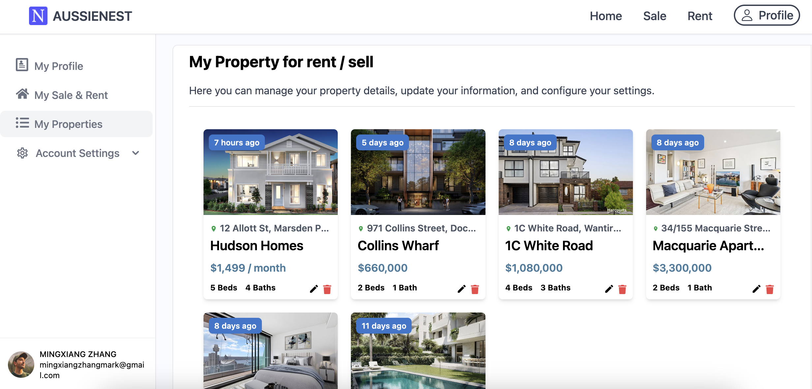
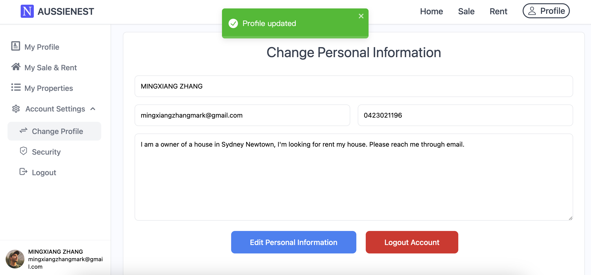

# AUSSIE-NEST

Aussienest is a real estate sales and rental website where people can browse properties for sale or rent and share links or send emails to the property owner through the website. If users want to learn more, they can choose to log in (with support for Google login and username/password login). After logging in, users can add and edit their personal account information, and add, view, and modify property information they wish to rent or sell. This information will be updated in real-time and shared with all users on the website.

Live demo link: https://aussienest.vercel.app/

- Front-end: React, Tailwind CSS
- Back-end: JavaScript
- Database: Firestore/Firebase
- Deploy: Vercel
- Tools: Router, React-Moment, Google Map, Google Auth, React toastify, swiper, uuid

website Overview:

